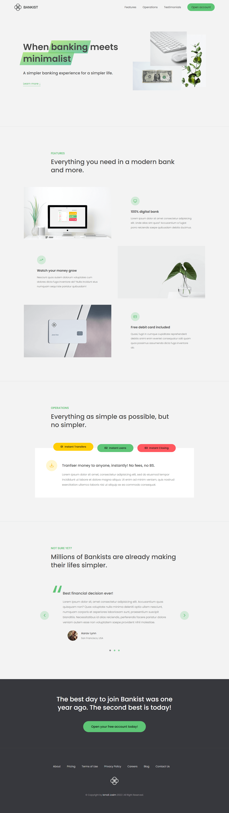

<h2>About the project</h2>

  <h4><b>Bankist</b> Bank service landing page.</h4>

👉 Live Demo: <a target='_blank' href='https://bankist-service-landing-page.netlify.app/'>Project Demo</a>

<h3>Build with:</h3>

*  HTML5

*  CSS3
*  JS

<h2>Screenshots of the Project 🖼️</h2>

